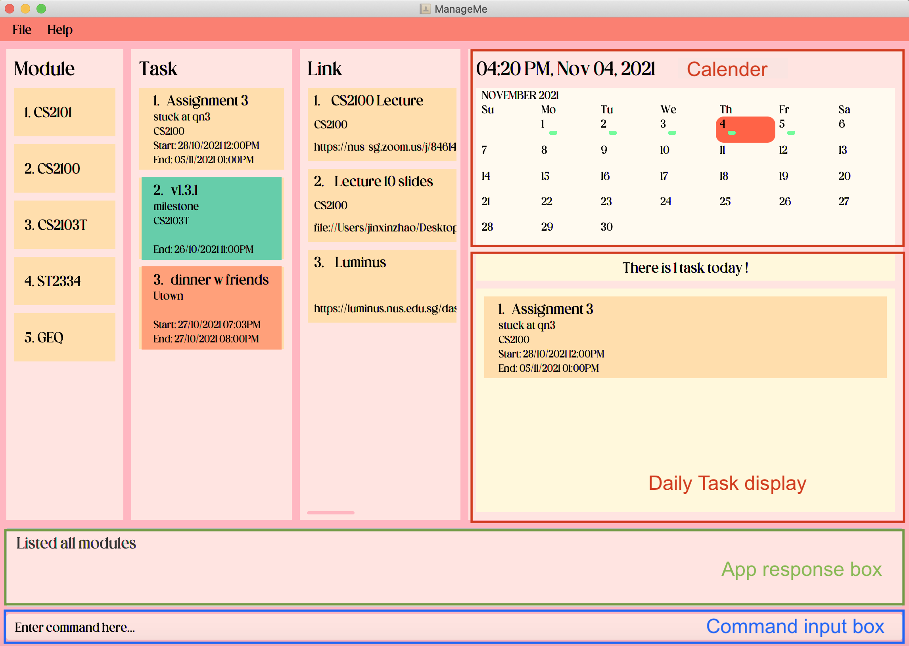

Hello World!!
* ManageMe is **a desktop app for time management and resource organisation, targeted at students**. 
  Example usages:
  * as a calendar that keep tracks of upcoming tasks like Todos, Events and Deadlines.
  * as a platform to store material related to modules taken by the student
* It is optimized for use via a **Command Line Interface (CLI)** while still having the benefits of a **Graphical User Interface (GUI).** If you can type fast, ManageMe can get your tasks done faster than traditional GUI apps.
* ManageMe is an ongoing software project with regular updates and constantly improving features.
  * It is **written in OOP fashion** and provides a **reasonably well-written** code base with around **6k LoC**.
  * It comes with a **reasonable level of user and developer documentation**.
* For the detailed documentation of this project, see the **[ManageMe Website](https://ay2122s1-cs2103t-w11-3.github.io/tp/)**.
* This project is **based on the AddressBook-Level3 project** created by the [SE-EDU initiative](https://se-education.org).
