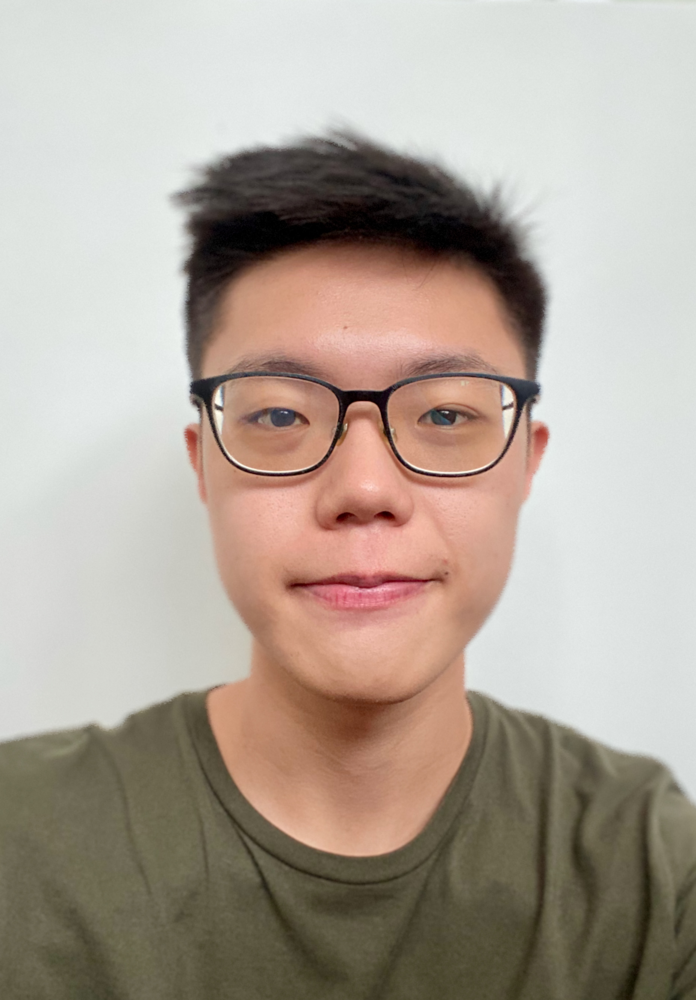
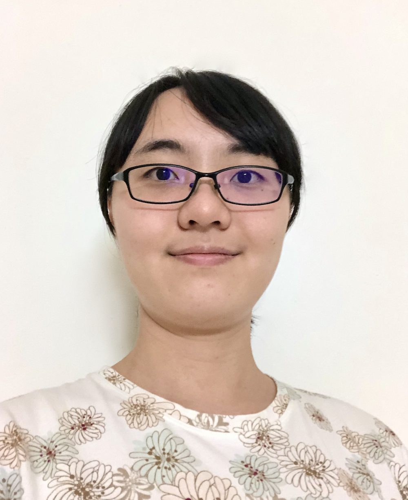
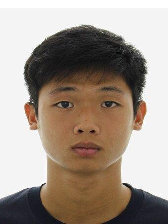

We are a team based in the [School of Computing, National University of Singapore](http://www.comp.nus.edu.sg).

You can reach us at the email `seer[at]comp.nus.edu.sg`

## Project team

### Markus Lim

[[github](https://github.com/markuslim24)]
[[portfolio](team/markuslim24.md)]

* Role: Team Lead
* Responsibilities: Host meeting

### Zhu Tianqi

[[github](http://github.com/Tianqi-Zhu)]
[[portfolio](team/tianqi-zhu.md)]

* Role: Developer
* Responsibilities: Deliverable and deadlines, Scheduling and tracking, Github master

### Zhao Jinxin

[[github](http://github.com/JinxinZhao315)]
[[portfolio](team/jinxinzhao315.md)]

* Role: Developer
* Responsibilities: Documentation

### Chow Rui Yan

[[github](https://github.com/chowRuiYan)]
[[portfolio](team/chowruiyan.md)]

* Role: Testing

### Zhang Cheng Chuan

[[github](http://github.com/zhangchengchuan)]
[[portfolio](team/zhangchengchuan.md)]

* Role: Developer
* Responsibilities: In charge of integration
