## **Table of Contents**
* Table of Contents
{:toc}

--------------------------------------------------------------------------------------------------------------------

## **Introduction**

Welcome to ManageMe’s Developer Guide (DG).

ManageMe is a **lightweight but powerful desktop application built to help university students manage their school life, available on Windows, Linux and Mac**. Students can add modules, tasks, schedules and online learning resources easily into ManageMe and access them with simple commands. The application is optimized for use via a **Command Line Interface (CLI)** but also provides a simple and convenient Graphical User Interface (GUI) for interaction.

The detailed guide below will provide developers like yourself, information such as how exactly ManageMe is built, **the architectural diagrams, user stories, product scope, common use cases and non-functional requirements.** At the end of this guide, we hope that you gained a much greater understanding of how ManageMe works and hopefully, you are able to contribute to this project as well.

The Developer Guide is formatted in a way that every single section is preceded by a header. In those sections, there will be some screenshots and explanations to better your understanding. Terms that are in `this format` signifies that it is a part of the codebase, such as a class or a directory. E.g `Logic`, `Storage`

In the event that you are lost on the page, scroll down to the end of each section and click on return to [Table of Contents](#table-of-contents).

--------------------------------------------------------------------------------------------------------------------

## **Acknowledgements**

* This project is based on the educational project [AddressBook Level3](https://github.com/se-edu/addressbook-level3)

--------------------------------------------------------------------------------------------------------------------

## **Setting up, getting started**

Refer to the guide [_Setting up and getting started_](SettingUp.md).

Return to [Table of Contents](#table-of-contents).

--------------------------------------------------------------------------------------------------------------------

## **Design**

:bulb: **Tip:** The `.puml` files used to create diagrams in this document can be found in the [diagrams](https://github.com/AY2122S1-CS2103T-W11-3/tp/tree/master/docs/diagrams) folder. Refer to the [_PlantUML Tutorial_ at se-edu/guides](https://se-education.org/guides/tutorials/plantUml.html) to learn how to create and edit diagrams.

Return to [Table of Contents](#table-of-contents).

### Architecture

[comment]: <> (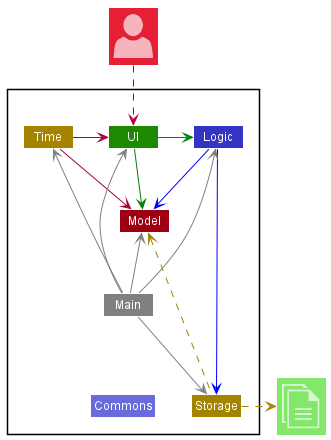)
  

The ***Architecture Diagram*** given above explains the high-level design of the App.

Given below is a quick overview of main components and how they interact with each other.

**Main components of the architecture**

**`Main`** has two classes called [`Main`](https://github.com/AY2122S1-CS2103T-W11-3/tp/blob/master/src/main/java/manageme/Main.java) and [`MainApp`](https://github.com/AY2122S1-CS2103T-W11-3/tp/blob/master/src/main/java/manageme/MainApp.java). It is responsible for,
* At app launch: Initializes the components in the correct sequence, and connects them up with each other.
* At shut down: Shuts down the components and invokes cleanup methods where necessary.

[**`Commons`**](#common-classes) represents a collection of classes used by multiple other components.

The rest of the App consists of five components.

* [**`UI`**](#ui-component): The UI of the App.
* [**`Logic`**](#logic-component): The command executor.
* [**`Model`**](#model-component): Holds the data of the App in memory.
* [**`Storage`**](#storage-component): Reads data from, and writes data to, the hard disk.
* [**`Time`**](#time-component): Keeps track of all tasks and ensures timely notifications when a task is due to start or end.

**How the architecture components interact with each other**

The *Sequence Diagram* below shows how the components interact with each other for the scenario where the user issues the command `deleteTask 1`.

The `Time` component is not shown as it runs on a separate thread concurrently from the main thread, which executes commands.

[comment]: <> (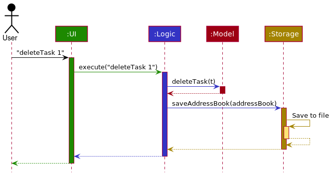)
  

Each of the five main components (also shown in the diagram above, except `Time`),

* defines its *API* in an `interface` with the same name as the Component.
* implements its functionality using a concrete `{Component Name}Manager` class (which follows the corresponding API `interface` mentioned in the previous point.

For example, the `Logic` component defines its API in the `Logic.java` interface and implements its functionality using the `LogicManager.java` class which follows the `Logic` interface. Other components interact with a given component through its interface rather than the concrete class (reason: to prevent outside components being coupled to the implementation of a component), as illustrated in the (partial) class diagram below.

  

The sections below give more details of each component.

Return to [Table of Contents](#table-of-contents).

The sections below give more details of each component.

### UI component

The **API** of this component is specified in [`Ui.java`](https://github.com/AY2122S1-CS2103T-W11-3/tp/blob/master/src/main/java/manageme/ui/Ui.java)

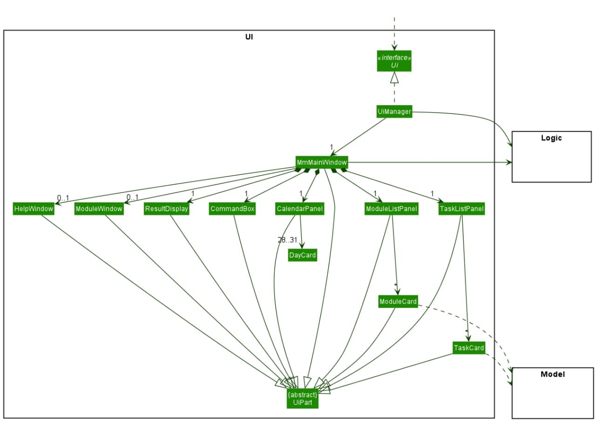

The UI consists of a `MmMainWindow` that is made up of parts e.g.`CommandBox`, `ResultDisplay`, `ModuleListPanel`, `TaskListPanel` etc. All these, including the `MmMainWindow`, inherit from the abstract `UiPart` class which captures the commonalities between classes that represent parts of the visible GUI.

The `UI` component uses the JavaFx UI framework. The layout of these UI parts is defined in matching `.fxml` files that are in the `src/main/resources/view` folder.
For example, the layout of the [`MmMainWindow`](https://github.com/AY2122S1-CS2103T-W11-3/tp/blob/master/src/main/java/manageme/ui/MmMainWindow.java)
is specified in [`MmMainWindow.fxml`](https://github.com/AY2122S1-CS2103T-W11-3/tp/blob/master/src/main/resources/view/MmMainWindow.fxml)

The `UI` component,

* executes user commands using the `Logic` component.
* listens for changes to `Model` data so that the UI can be updated with the modified data.
* keeps a reference to the `Logic` component, because the `UI` relies on the `Logic` to execute commands.
* depends on some classes in the `Model` component, as it displays `Module` and `Task` objects residing in the `Model`.

Return to [Table of Contents](#table-of-contents).

### Logic component

**API** : [`Logic.java`](https://github.com/AY2122S1-CS2103T-W11-3/tp/blob/master/src/main/java/manageme/logic/Logic.java)

Here's a (partial) class diagram of the `Logic` component:

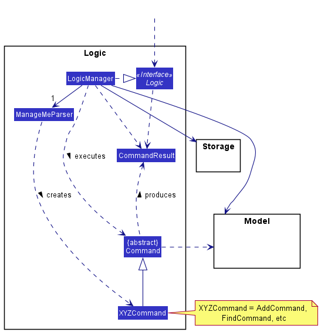

How the `Logic` component works:
1. When `Logic` is called upon to execute a command, it uses the `ManageMeParser` class to parse the user command.
1. This results in a `Command` object (more precisely, an object of one of its subclasses e.g., `AddTaskCommand`) which is executed by the `LogicManager`.
1. The command can communicate with the `Model` when it is executed (e.g. to add a task).
1. The result of the command execution is encapsulated as a `CommandResult` object which is returned back from `Logic`.

The Sequence Diagram below illustrates the interactions within the `Logic` component for the `execute("deleteTask 1")` API call.

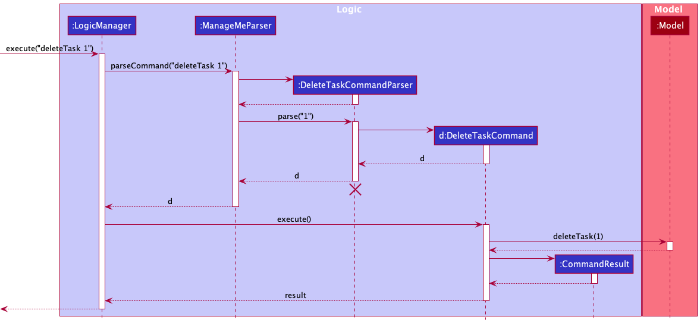

:information_source: **Note:** The lifeline for `DeleteTaskCommandParser` should end at the destroy marker (X) but due to a limitation of PlantUML, the lifeline reaches the end of diagram.

Here are the other classes in `Logic` (omitted from the class diagram above) that are used for parsing a user command:

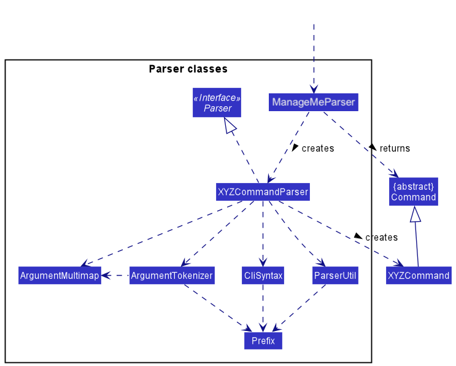

How the parsing works:
* When called upon to parse a user command, the `ManageMeParser` class creates an `XYZCommandParser` (`XYZ` is a placeholder for the specific command name e.g., `AddTaskCommandParser`) which uses the other classes shown above to parse the user command and create an `XYZCommand` object (e.g., `AddTaskCommand`) which the `ManageMeParser` returns back as a `Command` object.
* All `XYZCommandParser` classes (e.g., `AddTaskCommandParser`, `DeleteTaskCommandParser`, ...) inherit from the `Parser` interface so that they can be treated similarly where possible e.g, during testing.

Return to [Table of Contents](#table-of-contents).

### Model component
Here's a class diagram of the `Model` component:

**API** : [`Model.java`](https://github.com/AY2122S1-CS2103T-W11-3/tp/blob/master/src/main/java/manageme/model/Model.java)

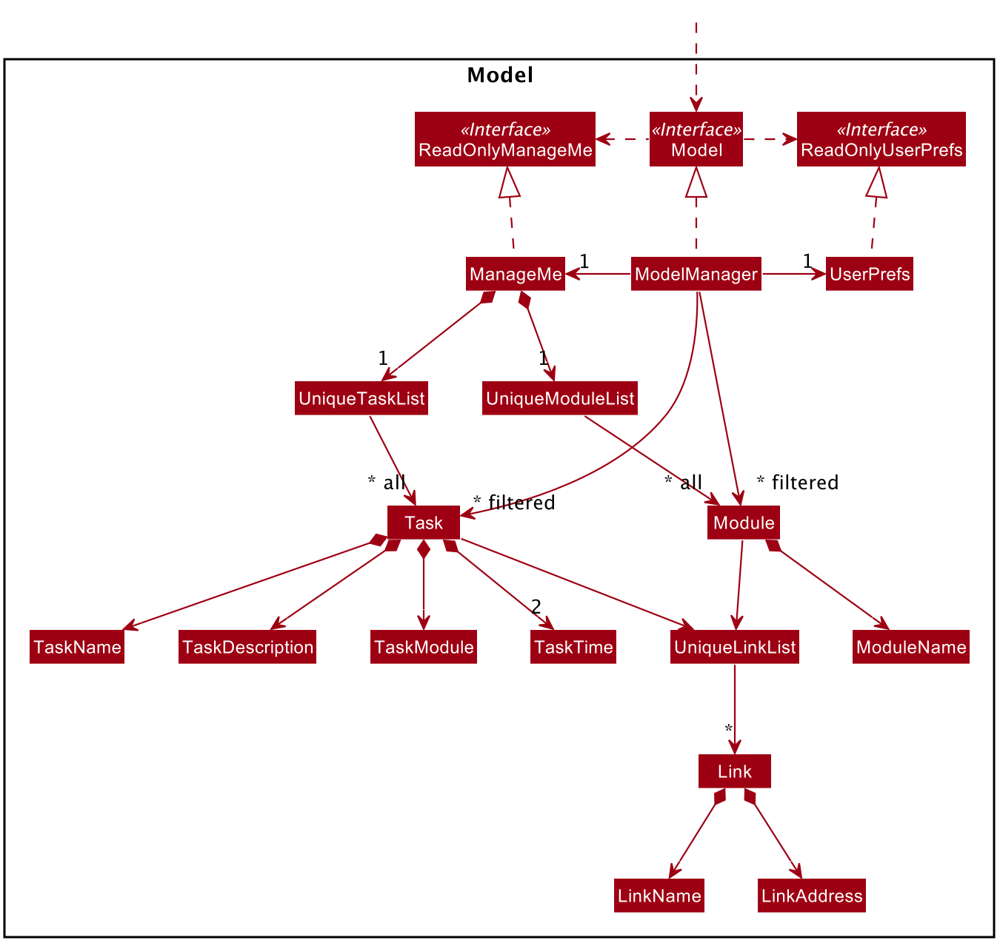

The `Model` component,

* store the object data of ManageMe i.e., all `Module`, `Task` and `Link` objects (which are contained in a`UniqueModuleList` object, a `UniqueTaskList` and a `UniqueLinkList` respectively).
* stores the currently 'selected' `Task` objects (e.g., results of a search query) as a separate _filtered_ list
  which is exposed to outsiders as an unmodifiable `ObservableList<Task>` that can be 'observed' e.g. the UI can be
  bound to this list so that the UI automatically updates when the data in the list change. The `Module` and `Link`
  objects similarly follow this implementation.
* As `TaskModule` and `TaskTime` are optional fields, their values are internally stored within a Java `Optional`
  object.
* stores a `UserPref` object that represents the user’s preferences. This is exposed to the outside as a `ReadOnlyUserPref` object.
* does not depend on any of the other three components (as the `Model` represents data entities of the domain, they should make sense on their own without depending on other components)

[comment]: <> (
:information_source: **Note:** An alternative &#40;arguably, a more OOP&#41; model is given below. It has a `Tag` list in the `AddressBook`, which `Person` references. This allows `AddressBook` to only require one `Tag` object per unique tag, instead of each `Person` needing their own `Tag` objects. )

Return to [Table of Contents](#table-of-contents).

### Storage component

**API** : [`Storage.java`](https://github.com/AY2122S1-CS2103T-W11-3/tp/blob/master/src/main/java/manageme/storage/Storage.java)

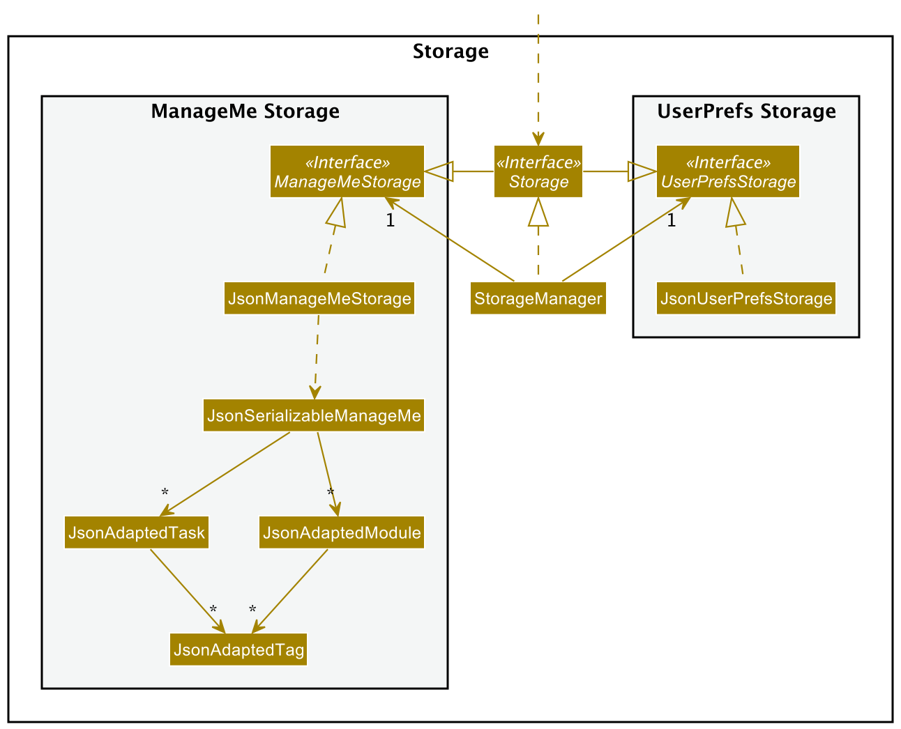

The `Storage` component,
* can save both ManageMe data and user preference data in JSON format, and read them back into corresponding objects.
* inherits from both `ManageMeStorage` and `UserPrefStorage`, which means it can be treated as either one (if only the functionality of only one is needed).
* depends on some classes in the `Model` component (because the `Storage` component's job is to save/retrieve objects that belong to the `Model`)

Return to [Table of Contents](#table-of-contents).

### Common classes

Classes used by multiple components are in the `manageme.commons` package.

Return to [Table of Contents](#table-of-contents).

### Time component

**API** : [`Time.java`](https://github.com/AY2122S1-CS2103T-W11-3/tp/blob/master/src/main/java/manageme/time/Time.java)

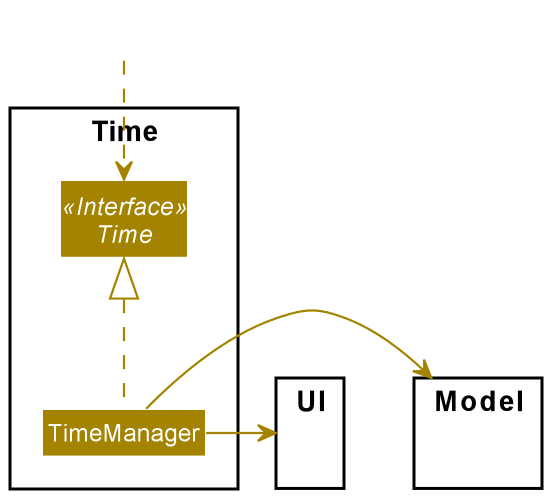

The `Time` component,
* is used as a standalone component to facilitate the tracking of time.
* enables notifications by comparing tasks' start and end time with system time. If any tasks trigger a notification,
the `TimeManager` will show a pop-out to remind the user.
* makes reference to both UI and Model components. This is because `TimeManager` needs the UI Component to
show the pop-out window while the Model component provides the latest state of ManageMe, which ensures that tasks
are kept up to date and that any changes are recorded and reflected.

Return to [Table of Contents](#table-of-contents).

--------------------------------------------------------------------------------------------------------------------

## **Implementation**
This section describes some noteworthy details on how certain features are implemented.

### Task Feature
In this section, the functionality of the Task feature and the sequence diagram for its related commands will be
discussed.

#### Implementation
Similar to the commands available in AB3, a user is able to add, edit, delete, find and list tasks and is
implemented as the `AddTaskCommand`,`EditTaskCommand`, `DeleteTaskCommand`, `FindTaskCommand` and `ListTaskCommand`
respectively.

To give an example, the activity diagram when the addTask Command is executed is shown below:
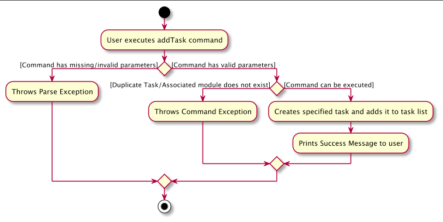  
*Activity diagram of creation of Task*

Additionally, a user is also able to mark/unmark tasks as done and delete tasks that are already done. This is
implemented as the `MarkTaskCommand` and `DeleteDoneTaskCommand` respectively.

Shown below is the sequence diagrams for when  `MarkTaskCommand` and `DeleteDoneTaskCommand` are executed.
  
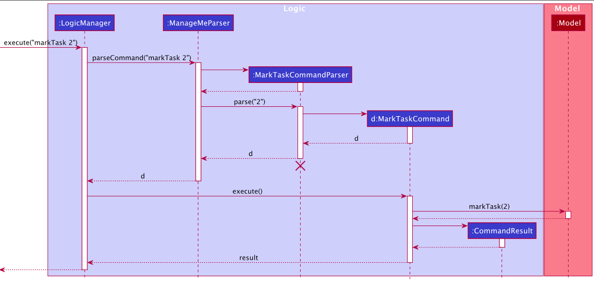  
*Sequence diagram of marking task 2 in the task list as done/undone*
 
 
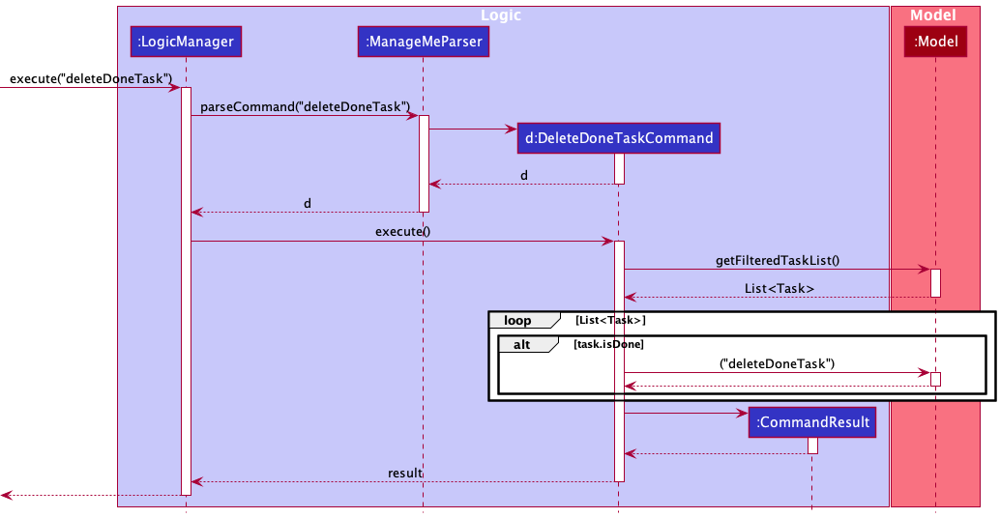  
*Sequence diagram of deleting all done tasks*

### Read Module Feature
ManageMe allows you to type in `readMod` for a particular module, and see all `Task` and `Link` related to it in a pop-up window.

#### Implementation
Read module makes use of both the UI component which creates a pop-up window for display, and the Logic component
which parses user commands and decide which module to read.

In the UI component, the `MmMainWindow` class, which controls the display of the UI homepage, 
calls the `executeCommand` function of the Logic component and gets back a `CommandResult`, which contains 
information about the results of the execution. A boolean value in `CommandResult`, `isReadModule`, indicates whether a 
Read Module window should be popped up. Once `isReadModule` is true, `MmMainWindow` will call the `ModuleWindow` 
class and generate a pop-up window.

In the Logic component, once `executeCommand` is called in `LogicManager`, `ManageMeParser` and `ReadModuleCommandParser`
parses the module index the user inputted, and generates a `ReadModuleCommand` object. `LogicManager` then executes the
`ReadModuleCommand` object, which sets what module is to be read in the `Model` component. A `CommandResult` 
is generated with `isReadModule` boolean value being true and sent back to `MmMainWindow`.

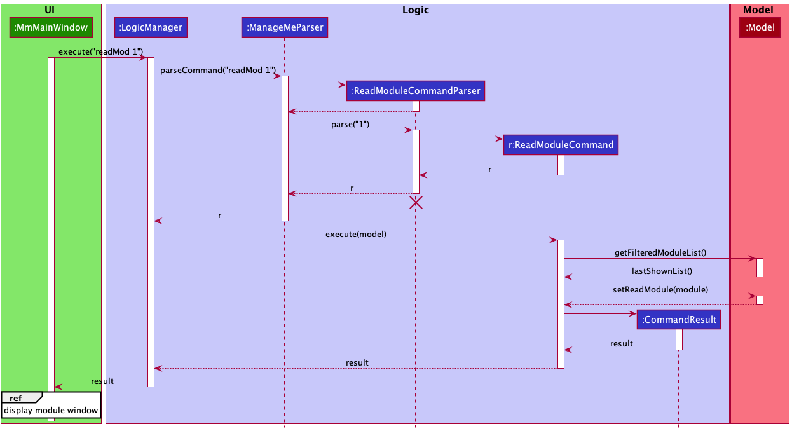  
*Sequence diagram for readMod command*  

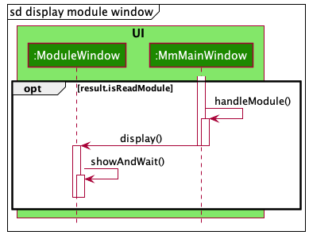  
*Referenced Sequence diagram*  

### Calendar Feature
ManageMe has a calendar feature for users to view all of their upcoming tasks for the month.

##### Implementation
The `CalendarPanel` consists of two main components, calendar and a task-list panel. A note-worthy field of the `CalendarPanel` is `referenceDate` whereby the task list panel displays the tasks happening on `referenceDate` in greater details. The month that is displayed is also based on the `referenceDate`. The default `referenceDate` is the current date when the application is first opened.   
Calendar provides a visual representation of the user's schedule for the month. Days with upcoming tasks are denoted by a green dot. The `calendarPlaceholder`, which is the frame for the calendar, is a `GridPane`. The first row of the `GridPane` is a `Label` which represents a specific month and year. The second row has seven column where each cell is `Label` which represents the day-of-week. From the third row onwards, each cell is made up of a `DayCard`, which extends `UiPart<Region>` and represents a day in the calendar. The `DayCard` is made up of a `Label` and `Rectangle` with two `PseudoClass` to differentiate days with tasks and the reference date.   
Task-list panel displays the tasks happening on `referenceDate` in greater details. It is made up of a `VBox` which contains a `Label`, which is the title, and a `StackPane`, which contains a `ListView<Task>`.   
The following sequence diagram demonstrates how the Calendar is created.

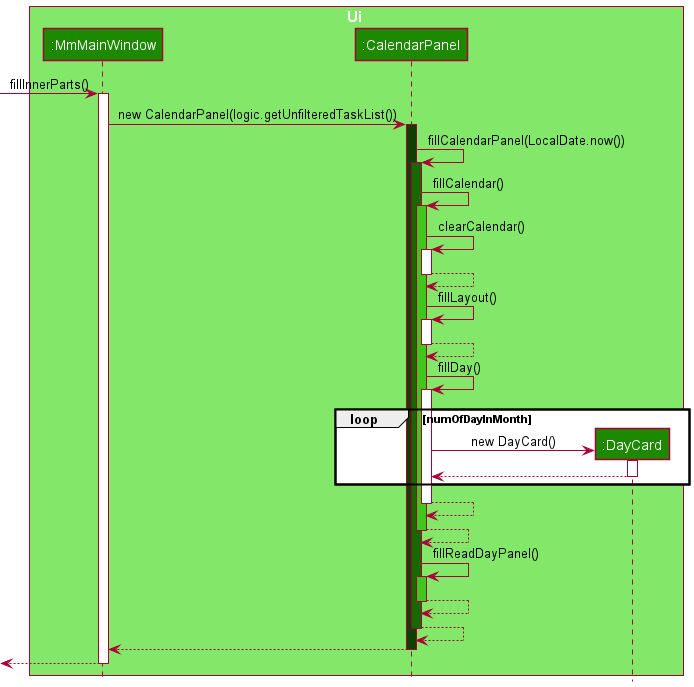  
*Sequence diagram of creation of Calendar*

Since the `CalendarPanel` is constructed with an `ObservableList<Task>`, changes to `UniqueTaskList` made by user using `addTask`, `deleteTask` and `editTask` will be reflected in the calendar automatically.   
Calendar has three functionality, `prevMonth`, `nextMonth` and `readDay`, all of which manipulate `referenceDate`, which is the key component for generating the whole calendar GUI. Both `prevMonth` and `nextMonth` subtracts or adds the current `referenceDate` by a month respectively. While `readDay` takes in a `LocalDate` as argument and replace the `referenceDate` with it.

##### Design Consideration
The main consideration for the design of calendar is how many days should be displayed. The initial implementation was a "Week Calendar" which uses the current version of [NUSMODS](https://nusmods.com/timetable/sem-1) as reference. However, this design implies that there cannot be an overlap in the timing of different tasks. It would work for NUSMODS since it is a timetable and classes are not supposed to clash. However, it will not be as suitable for a calendar since multiple tasks can be happening or due at the same time. We decided to use the current implementation which is a "Month Calendar" with markings to represent the existence of tasks in the respective day-of-month and a task-list panel to display the tasks in greater details.  
 
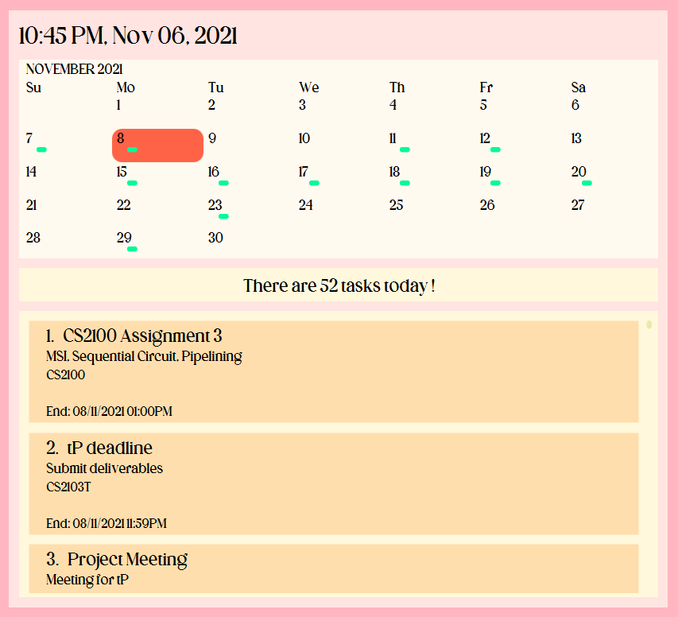  
*Screenshot of GUI of calendar in ManageMe.*

### Reminder Feature
In this section, the functionality of the reminder feature and its activity diagram will be discussed.

#### Implementation
Reminders are implemented under the `TimeManager` Class which is located under the `time` package.

The main thread, which handles the user inputs and command
execution, will operate as per normal, except that an additional thread runs alongside it.

This additional **Time** Thread will constantly check all the current tasks to make sure
that the user is notified of any tasks that requires attention.
This notification appears in the form of a pop-out window with implementation located under the `time` package.

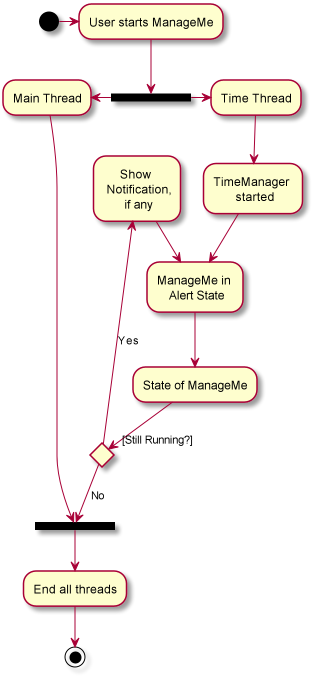  

*Reminders Activity Diagram*

The above figure illustrates the execution path of Reminders when the user starts ManageMe, which has been shortened
to **MM** in the activity diagram.

When the user starts the application, 2 threads are immediately started. The **Main Thread** and the **Time** Thread.

For this activity diagram, the entire **Main Thread** will be represented by one action block only as this is not the
main focus.

The following actions occur when the **Time Thread** is started:
1. `TimeManager` is initialized and starts to run.
2. ManageMe is now in an **Alert State**. This means that this thread is constantly checking if ManageMe is still
   running.
    1. If it is, check if there are any tasks that the user needs to be notified of. Once done,
       return to **Alert State**.
    2. If it is not, all threads including **Main Thread** will be ended and the application ends.

 

:information_source: **Note:** As long as ManageMe is still running, it
will continue to scan for tasks that need the user's attention.

### Archive Feature
In this section, the archive feature and its activity diagram will be discussed.

#### Implementation
The archive feature is implemented as the `ArchiveCommand` and allows the user to archive the current data into a timestamped file in the data folder and resets the application with a new data file.

The following Activity diagram demonstrates the execution path of the archive command:   
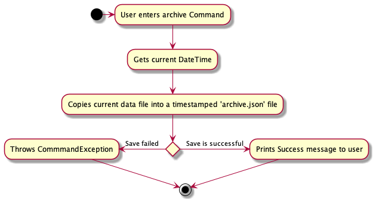  
*Activity diagram of execution of archive command*
 

Return to [Table of Contents](#table-of-contents).

--------------------------------------------------------------------------------------------------------------------

## **Documentation, logging, testing, configuration, dev-ops**

* [Documentation guide](Documentation.md)
* [Testing guide](Testing.md)
* [Logging guide](Logging.md)
* [Configuration guide](Configuration.md)
* [DevOps guide](DevOps.md)

Return to [Table of Contents](#table-of-contents).

--------------------------------------------------------------------------------------------------------------------

## **Appendix A: Product scope**

**Target user profile**:

A Digital-Age, university student who...
* Needs to organize multiple tasks (events, tasks, and deadlines), some of which involve computer files stored locally.
* Needs to organize multiple modules with many links to relevant online resources.
* Prefers visualizing all tasks on a calendar for a clear and quick presentation.
* Prefers desktop application over the mobile application.
* Prefers typing over the use of the mouse.
* Comfortable with the use of Command Line Interface (CLI).

**Value proposition**:
* Manage modules and tasks faster than a typical mouse/GUI-driven app.
* Manage multiple web links and file paths associated with modules and tasks.
* Summarises crucial information clearly such as:
  1. Tasks due Today and
  2. Upcoming Events on the Calendar

Return to [Table of Contents](#table-of-contents).

-----------------------------------------------------------------------------------------------

## **Appendix B: User stories**

Priorities: High (must have) - `* * *`, Medium (nice to have) - `* *`, Low (unlikely to have) - `*`

| Priority | As a …​                                 | I can …​                                                           | So that …​                                                                  |
| -------- | ------------------------------------------ | --------------------------------------------------------------------- | --------------------------------------------------------------------------     |
| `* * *`  | Forgetful User                             | Add tasks                                                             | I can keep track of the tasks that I need to do                                |
| `* * *`  | Forgetful User                             | Add start and end times to tasks                                      | I know when a task starts and ends                                             |
| `* * *`  | Forgetful User                             | Mark a task as done                                                   | I can keep track of the tasks that I have done                                 |
| `* * *`  | Forgetful User                             | View all my tasks                                                     | I can refer to it when needed                                                  |
| `* * *`  | Forgetful User                             | Associate a task with a module                                        | I know which module each task belongs to                                       |
| `* * *`  | Forgetful User                             | Edit my tasks                                                         | I can change information related to a task                                     |
| `* * *`  | Forgetful User                             | Delete my tasks                                                       | I can remove done or unwanted tasks                                            |
| `* * *`  | Forgetful User                             | Search for a task using keywords                                      | I can find a task quickly by its name                                          |
| `* * *`  | Student                                    | Add modules                                                           | I can keep track of the modules that I am taking                               |
| `* * *`  | Student                                    | View all my modules                                                   | I can refer to it when needed                                                  |
| `* * *`  | Student                                    | View all tasks and links associated with a module                     | I can view all module-related tasks and links in one place                     |
| `* * *`  | Student                                    | Edit my modules                                                       | I can change information related to a module.                                  |
| `* * *`  | Student                                    | Delete my modules                                                     | I can remove modules that I am no longer taking                                |
| `* * *`  | Student                                    | Search for a module using keywords                                    | I can find a module quickly by its name                                        |
| `* * *`  | Digital-age student                        | Add a link                                                            | I can keep track of that website links and computer files that I use           |
| `* * *`  | Digital-age student                        | Delete a link                                                         | I can remove links that I no longer use                                        |
| `* * *`  | Digital-age student                        | Edit a link                                                           | I can change information related to a link                                     |
| `* * *`  | Digital-age student                        | Search for a link using keywords                                      | I can find a link quickly by its name                                          |
| `* * *`  | Digital-age student                        | View all my links                                                     | I can refer to it when needed                                                  |
| `* * *`  | Busy user                                  | View calendar                                                         | I can check the dates easily                                                   |
| `* * *`  | Busy Student                               | View all tasks in a single day in the calendar according to its date  | I know what are the tasks that I have on a particular date                     |
| `* * *`  | Busy Student                               | See which days have ongoing tasks in a calendar                       | I know which days I am free                                                    |
| `* *`    | Digital-Age Student                        | Open links                                                            | I can access module-related web links and files directly from the application  |
| `* *`    | New User                                   | Open the command summary                                              | I know what commands are available and how to use them                         |
| `* *`    | Experienced User                           | Close the command summary                                             | I can save screen space after I am familiar with the commands.                 |
| `*`      | Long-term user                             | Archive all the data                                                  | I can store old data to make space for new data.                               |

>>>>>>> 54783f6e88eda4d7c37efc165252b34a2a3bb6f5

Return to [Table of Contents](#table-of-contents).

----------------------------------------------------------------------------------------------------------------

## **Appendix C: Common Use cases**

(For all use cases below, the **System** is `ManageMe` unless specified otherwise)

**:information_source: Usage** 

*  All “generic” use cases below can be applied to Tasks, Modules, and Links 

### Use case 01: Generic Add

**MSS:**
1. User requests to add a task/module/link with its details.
2. System adds the new task/module/link and displays it.  
   Use case ends.

**Extensions:**
* 1a. Compulsory parameters are missing, including names, description for tasks, and address for links.
  * 1a1. The system shows the missing parameter error message and shows the correct format. 
  * Use case resumes from step 1.
* 1b. Parameters entered are invalid, including invalid characters in the name, invalid date-time in the task, and invalid addresses in links.
  * 1b1. System shows error in format. 
  * Use case resumes from step 1.

### Use case 02: Generic Edit

**MSS:**
1. User requests to edit a specified task/module/link and enters the new details.
2. System updates the details and displays the edited task/module/link.  
   Use case ends.

**Extensions:**
* 1a. User enters an invalid index.  
    * 1a1. System shows error in reading index. 
    * Use case resumes from step 1.
* 1b. Parameters entered are of invalid format, including invalid characters in names, invalid date-time for tasks, and invalid address for links.
    * 1b1. System shows error in parsing data. 
    * Use case resumes from step 1.   

### Use case 03: Generic Delete

**MSS:**

1. User requests to delete a specified task/module/link.
2. System removes the specified task/module/link from the list and shows the new updated list.  
   Use case ends.

**Extension:**

* 1a. User enters an invalid index
    * 1a1. System shows error in reading index. 
    * Use case resumes from step 1.
    
### Use case 04: Generic Find

**MSS:**

1. User requests to search for specific tasks/modules/links by keyword.
3. System updates the GUI to show a list of all task/modules/links whose name contains the keyword.  
   Use case ends.

**Extension:**

* 1a. User does not enter a keyword.  
    * 1a1. System shows invalid format error. 
    * Use case resumes from step 1.

### Use case 05: Generic List

**MSS:**

1. User requests to list all tasks/modules/links.
3. System updates the GUI to show the full list.  
   Use case ends.

Return to [Table of Contents](#table-of-contents).

-------------------------------------------------------------------------------------------------------------------------

## **Appendix D: Non-Functional Requirements**

1. Should work on any _mainstream OS_ as long as it has Java `11` or above installed.
2. Should be able to hold up to 1000 tasks, modules and links without a noticeable sluggishness in performance for typical usage.
3. A user with above-average typing speed for regular English text (i.e. not code, not system admin commands) should be able to accomplish most of the tasks faster using commands than using the mouse.
4. The system will not be responsible for checking the validity of external links entered into the system, such as Zoom links or Luminus links. They must be checked beforehand by the user.

Return to [Table of Contents](#table-of-contents).

----------------------------------------------------------------------------------------------------------------------

## **Appendix E: Glossary**

* **Mainstream OS**: Windows, Linux, Unix, OS-X
* **Digital-age:** A post-pandemic world where many schools have switched to online teaching and learning.
* **Module:** A course taken by a student, typically in a university.
* **Online resources:** Websites used by many schools in the post-pandemic world for teaching, file submission, and assessment. For example, Zoom, Luminus, Examplify etc.
* **Command Line Interface (CLI):** An interface where the user primarily gives command to the computer by typing text lines, instead of clicking and dragging graphic components.

Return to [Table of Contents](#table-of-contents).

--------------------------------------------------------------------------------------------------------------------

## **Appendix F: Instructions for manual testing**

Given below are instructions to test the app manually.

:information_source: **Note:** These instructions only provide a starting point for testers to work on;
testers are expected to do more *exploratory* testing.

### Launch and shutdown

1. Initial launch

    1. Download the jar file and copy it into an empty folder

    2. Double-click the jar file.  
       Expected: Shows the GUI with a set of sample contacts. The window size may not be optimum.

1. Saving window preferences

    1. Resize the window to an optimum size. Move the window to a different location. Close the window.

    1. Re-launch the app by double-clicking the jar file. 
       Expected: The most recent window size and location is retained.

       
### Deleting a task

1. Deleting a task while all tasks are being shown

    1. Prerequisites: List all tasks using the `list` command. Multiple tasks in the list.

    1. Test case: `deleteTask 1` 
       Expected: First task is deleted from the list. Details of the deleted task are shown in the status message.

    1. Test case: `deleteTask 0` 
       Expected: No task is deleted. Error details are shown in the status message.

    1. Other incorrect delete commands to try: `deleteTask`, `deleteTask x`, `...` (where x is larger than the list size) 
       Expected: Similar to previous.

### Pop-up window

1. Test whether the pop-up window works in the app 

   1. Add a task with a starting time just 1 minute away from your current time . 
   Expected: A reminder will appear in a pop-up window for this ongoing task 1 min later.
   
   2. Type readMod for an existing module (if no module exists, add one with a simple name)
   Expected: A window appears that show all tasks and links associated with a module

### Saving data

1. Dealing with missing/corrupted data files

    1. If there is a `data/manageme.json` file in the same directory with the jar, open the file and remove a random bracket. Launch the program. 
       Expected: Warning of invalid JSON file will be shown in the terminal. A ManageMe with sample data will be launched.

    2. If there isn't a `data/manageme.json` file in the same directory with the jar. Launch the program and add a random task. Close the program. Remove a random bracket from the data file. Relaunch the program. 
       Expected: Warning of invalid json file will be shown in the terminal. A ManageMe with sample data will be launched.

Return to [Table of Contents](#table-of-contents).
