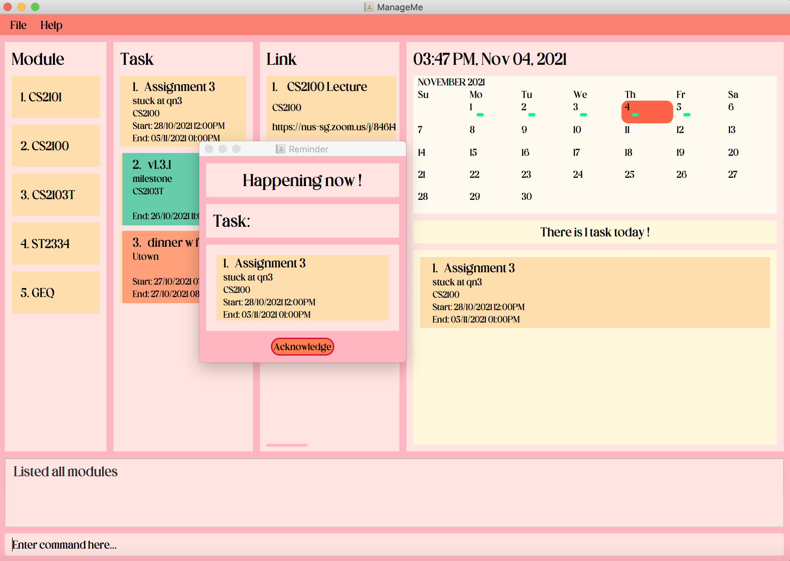
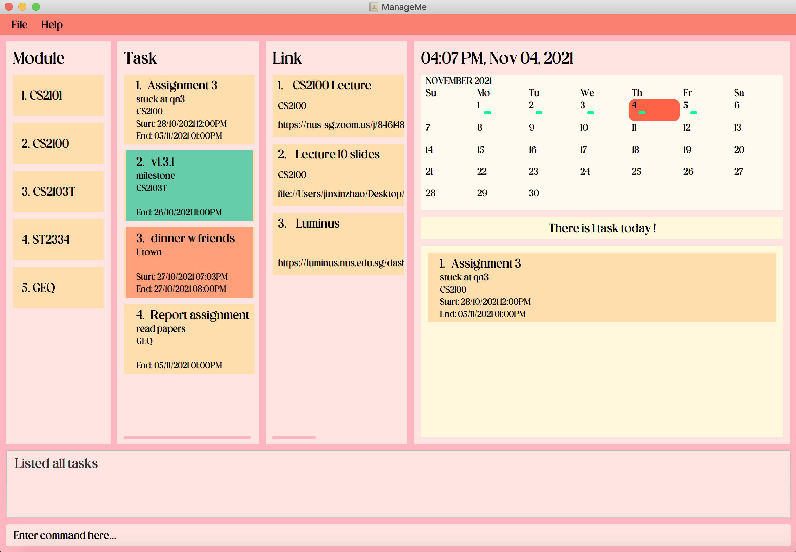
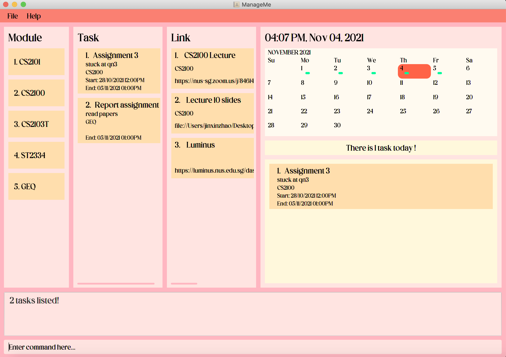
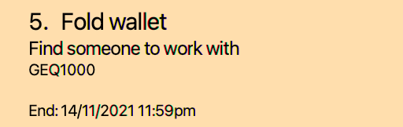
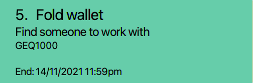
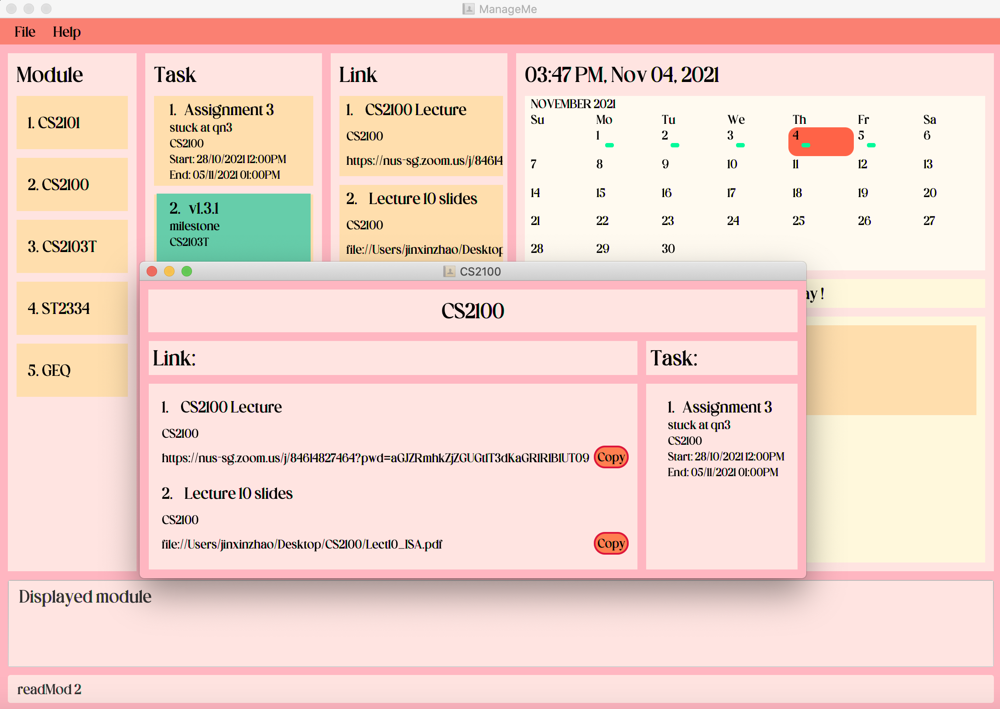
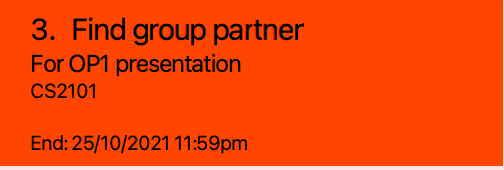

## Table of Contents

* Table of Contents
  {:toc}

--------------------------------------------------------------------------------------------------------------------

## Introduction:
ManageMe is a **lightweight but powerful desktop application built to help university students manage their school life, available on Windows, Linux and Mac**. You can add your modules, tasks, schedules and online learning resources easily into ManageMe and access them with simple commands. Whether you are a fast typer or a more visual user, ManageMe has you covered. The application is optimized for use via a **Command Line Interface (CLI)** but also provides a convenient Graphical User Interface (GUI) for interaction.

This user guide will give you a comprehensive understanding in using ManageMe to its full potential. Begin your journey with the [Quick Start](#quick-start) section. For a full overview of the user guide, check out the [Table of Contents](#table-of-contents).

--------------------------------------------------------------------------------------------------------------------

## Quick Start
This section aims to provide a quick introduction to using the application.
It should take less than 5 minutes to read and will provide new users with the necessary knowledge to install and start using the application.

### Steps for installation:
1. Ensure you have Java 11 or above installed in your Computer.
2. [Download](https://github.com/AY2122S1-CS2103T-W11-3/tp/releases) the latest jar release of ManageMe.
3. Open your browser's download folder and locate the downloaded jar file. ManageMe can run on multiple platforms, including Windows, Mac and Linux.
4. Move the jar file into your desired folder. ManageMe will use this folder to store its data by default.
5. Start the app by double-clicking on the jar file, or if you are using the command line, type `java -jar manageme.jar`.
6. Enjoy using the application!

### User Interface
Below is a screenshot of our User Interface (UI). As you can see, there are management panels for Modules, Tasks,
Calendar, and Links which can contain both website links and file paths stored on your computer. You can type command lines in the command input box, and the ManageMe's response will be shown in the app response box.

 *Homepage of Application*

### Basics
Type a command in the command box and press Enter to execute it.
Some example commands you can try:
* `addMod n/CS2103T`: Adds a module named "CS2103T".
* `deleteTask 1`: Deletes the 1st task shown in the current list.
* `editLink 3 n/CS2100 Exam Link`: Edits the name of the 3rd link shown in the current list to “CS2100 Exam Link”.
* `clear`: Deletes all modules, tasks and links in ManageMe. Use this command to reset ManageMe.
* `exit`: Exits the application.

Refer to [Features](features) below for details of each command.
  

Return to [Table of Contents](#table-of-contents)

--------------------------------------------------------------------------------------------------------------------

## Features
This section gives a full list of all the application's features with details such as the format, some tips and examples of using it.

**:information_source: Notes about the command format:** 

* Words in `UPPER_CASE` are the parameters to be supplied by the user. E.g. `addTask n/TASK_NAME`
  , here `TASK_NAME` is the parameter. 

* Items in square brackets are optional. E.g. `addTask n/TASK_NAME [mod/CS2103]` 

### Tasks:

#### Adding a task: `addTask`

Adds a task to the task list.

Format: `addTask n/NAME d/DESCRIPTION [mod/ASSOCIATED_MODULE_NAME] [s/START_DATETIME] [e/END_DATETIME]`

* A **name** and **description** for the task is **compulsory**.
* It is optional to include an associated Module name, a start datetime and an end datetime.
* A task created with a start datetime MUST also have an end datetime.
* Format for a `DATETIME` is as follows: `year-month-dayThr:min` e.g. `2021-10-29T23:59`

Example: `addTask n/Do CS2103T Assignment d/Refer to lecture 10 for examples mod/CS2103T s/2021-10-05T11:00
e/2021-10-07T23:59`

A reminder will pop-up when a task is happening: 
To close the reminder, press Enter or click on the Acknowledge button. Simply closing the window will not work and will cause the reminder to pop-up again!
 

*Pop-up reminder for tasks*
  

#### Edit a task: `editTask`
Edit an existing task in the task list.

Format: `editTask INDEX [n/NAME] [d/DESCRIPTION] [mod/ASSOCIATED_MODULE_NAME] [s/START_DATETIME] [e/END_DATETIME]`
* The index refers to the index number shown in the displayed module list
* The index **must be a positive integer** 1, 2, 3, ...
* At least one of the optional fields must be provided.
* Existing values will be updated to the input values.
* Format for a `DATETIME` is as follows: `year-month-dayThr:min` e.g. `2021-10-29T23:59`

Example: `editTask 3 d/Complete assignments e/2021-10-25T16:00`
  

#### Deleting a task: `deleteTask`
Deletes the specified task from the task list.

Format: `deleteTask INDEX`
* Deletes the task at the specified `INDEX`
* The index refers to the index number shown in the displayed task list.
* The index **must be a positive integer** 1, 2, 3, ...

Example: `deleteTask 2`
  

**:warning: Caution** 

* Deleting a task is irreversible. 

#### Find a task by keyword: `findTask`
Finds all tasks whose names contain any of the specified keywords.

Format: `findTask KEYWORD [MORE_KEYWORDS]`

* The search is case-insensitive. e.g lecture will match Lecture.
* The order of the keywords does not matter. e.g. Lecture Slide will match Slide Lecture.
* Only the name field is searched.
* Only full words will be matched e.g. Assignment will not match Assignments.
* Tasks matching at least one keyword will be returned (i.e. OR search).

Example: `findTask assignment`  
Before findTask: 
 

After findTask: 

  

#### List all tasks : `listTask`
Display the full list of tasks. This command is used to return to the full list
of tasks after searching for specific tasks.

Format: `listTask`
  

#### Mark a task as done/undone: `markTask`
Marks the specified task from the task list as done/undone. Marking a task that is done will change it to undone while marking a task that is not done will change it to done.

Format: `markTask INDEX`
- Marks the task at the specified `INDEX`
- The index refers to the index number shown in the displayed task list.
- The index **must be a positive integer** 1, 2, 3, ...

Example: `markTask 2`

Feature in UI: 

 
*An ongoing task not yet done will be in the default colour*
  

 
A task marked as done will be coloured green.
  

#### Delete all done tasks : `deleteDoneTask`
Deletes all tasks that have been marked as done from the task list.

Format: `deleteDoneTask`

**:warning: Caution** 

* Deleting a task that is marked as done is irreversible. 

 

Return to [Table of Contents](#table-of-contents).

### Modules:
#### Adding a module: `addMod`
Adds a module with its name into the module list.

Format: `addMod n/NAME`  
Examples: `addMod n/CS2103`
  

#### Read details of a module: `readMod`
View module in detail. Creates a pop-up window to show the course name, link, and all tasks associated with the course.

Format: `readMod INDEX` 
* The index refers to the index number shown in the displayed module list
* The index **must be a positive integer** 1, 2, 3, ...

Examples: `readMod 2`

Screenshot: 
 

*Pop-up window for readMod*
  

#### Edit a module: `editMod`
Edits an existing module in the mod list.

Format: `editMod INDEX [n/NAME]`
* Edits the mod by the specified `INDEX`. 
* The index refers to the index number shown in the displayed module list
* The index **must be a positive integer** 1, 2, 3, ...
* At least one of the optional fields must be provided.
* Existing values will be updated to the input values.

Example: `editMod 2 n/CS2103T`
  

#### Delete a module: `deleteMod`
Deletes the specified mod from the mod list.

Format: `deleteMod INDEX`
* Deletes the mod by the specified `INDEX`.
* The index refers to the index number shown in the displayed module list.
* The index **must be a positive integer** 1, 2, 3, ...

Example: `deleteMod 2` deletes module No.2 from the list.
  

**:warning: Caution** 

* Deleting a module is irreversible. 

#### Find a module by keyword: `findMod`
Finds modules whose names contain any of the given keywords.

Format: `findMod KEYWORD [MORE_KEYWORDS]`

* The search is case-insensitive. e.g hans will match Hans.
* The order of the keywords does not matter. e.g. Hans Bo will match Bo Hans.
* Only the name is searched.
* Only full words will be matched e.g. Han will not match Hans.
* Modules matching at least one keyword will be returned (i.e. OR search).

Example: `findMod computer` returns `Computer Organization` and `Computer Architecture`.
  

#### List all modules : `listMod`
Display the full list of modules. This command is used to return to the full list
of modules after searching for specific modules.

Format: `listMod`
  

Return to [Table of Contents](#table-of-contents).

### Links:
#### Add a link: `addLink`
Adds a link into the link list. A link contains its name and a website link for online learning.

Format: `addLink n/NAME a/LINK_ADDRESS [mod/ASSOCIATED_MODULE_NAME]`  
* A link should be in a valid uri format, beginning with https://, ftp:// of file:/
* Aftering tagging the module, the link will appear at in the readMod panel of the particular module

Examples: `addLink n/google a/https://www.google.com mod/CS1101S`
  

#### Edit a link: `editLink`
Edits an existing link in the link list.

Format: `editLink INDEX [n/NAME] [a/LINK_ADDRESS] [mod/ASSOCIATED_MODULE_NAME]`
* Edits the link by the specified `INDEX`. 
* The index refers to the index number shown in the displayed link list
* The index **must be a positive integer** 1, 2, 3, ...
* At least one of the optional fields must be provided.
* Existing values will be updated to the input values.

Example: `editLink 2 n/amazon`
  

#### Delete a link: `deleteLink`
Deletes the specified mod from the mod list.

Format: `deleteLink INDEX`
* Deletes the mod by the specified `INDEX`.
* The index refers to the index number shown in the displayed link list.
* The index **must be a positive integer** 1, 2, 3, ...

Example: `deleteLink 2` deletes link No.2 from the list.
  

**:warning: Caution** 

* Deleting a link is irreversible. 

#### Open a link:
Format: `openLink INDEX`
* Opens the link identifies by the index in the link list. If it is a link for a webpage, it will open the link in a browser. If it is a file path on your computer, it will open the file using the default app.
* The index refers to the index number shown in the displayed link list
* The index **must be a positive integer** 1, 2, 3, ...

Example: `openLink 1` open link No. 1 from the list of links.
  

#### Find a link by keyword:
Find a link whose name contains the keyword given.

Format: `findLink KEYWORD [MORE_KEYWORDS]`

* The search is case-insensitive. e.g hans will match Hans.
* The order of the keywords does not matter. e.g. Hans Bo will match Bo Hans.
* Only the name is searched.
* Only full words will be matched e.g. Han will not match Hans.
* Links with a name matching at least one keyword will be returned (i.e. OR search).

Example: `findLink computer` returns `Computer Organization https://....` and `Computer Architecture https://....`.
  

#### List all links: `listLink`
Display the full list of links. This command is used to return to the full list after findLink.

Format: `listLink`
  

Return to [Table of Contents](#table-of-contents).

### Calendar:
#### Change calendar to next month: `nextMonth`
Display the calendar for the next month. This command will
update the entire calendar panel to display the calendar and the related task information for the following month.

Format: `nextMonth`
  

#### Change calendar to previous month: `prevMonth`
Similar to `nextMonth`. However, this command display the calendar for the previous month instead.

Format: `prevMonth`
  

#### Read details happening on a day: `readDay`
View a day in detail. Tasks happening on the specified day will be displayed.

Format: `readDay DATE`
* `DATE` given must be a valid date.
* Format for a `DATE` is as follows: `year-month-day` e.g. `2021-10-19`

Example: `readDay 2021-10-19`
  

Return to [Table of Contents](#table-of-contents).

### Others:

#### Viewing help: `help`

Shows the command summary and the url to the full User Guide.

 

Format: `help`
  

#### Archive current data: `archive`

Resets the application data and saves the deleted application data into a timestamped file located in the data folder.
  

#### Exiting the program : `exit`

Exits the program.

#### Saving the data

Data is saved in the hard disk automatically after any command that changes the data. There is no need to save manually.
  

#### Reminder for overdue tasks:

Tasks that are overdue(past the end time) will automatically be coloured red for users to clearly see which tasks are
overdue.

Feature in UI: 
 
*A Task coloured red since it is overdue*

Return to [Table of Contents](#table-of-contents).

--------------------------------------------------------------------------------------------------------------------

## Command summary
This section serves as a quick reference for all the available commands that can be used in the application.

Action | Format, Examples
--------|------------------
**AddTask** | `addTask n/NAME d/DESCRIPTION [mod/ASSOCIATED_MODULE_NAME] [s/START_DATETIME] [e/END_DATETIME]` e.g., `addTask n/Do Assignment d/Read Lecture 7 mod/CS2100 s/2021-10-05T12:00 e/2021-10-07T23:59`
**EditTask** | `editTask INDEX [n/NAME] [d/DESCRIPTION] [mod/ASSOCIATED_MODULE_NAME] [s/START_DATETIME] [e/END_DATETIME]` e.g., `editTask 3 d/buy milk`
**DeleteTask** | `deleteTask INDEX` e.g., `deleteTask 3`
**findTask** | `findTask KEYWORD [MORE_KEYWORDS]` e.g., `findTask work`
**ListTask** | `listTask`
**MarkTask** | `markTask INDEX` e.g., `markTask 1`
**DeleteDoneTask** | `deleteDoneTask`
**AddModule** | `addMod n/NAME` e.g.,`addMod n/CS2103`
**ReadModule** | `readMod INDEX` e.g., `readMod 2`
**EditModule** | `editMod INDEX [n/NAME] [l/LINK]` e.g., `editMod 2 n/CS2103T l/https://...`
**DeleteModule** | `deleteMod INDEX` e.g., `deleteMod 2`
**FindModule** | `findMod KEYWORD [MORE_KEYWORDS]` e.g., `findMod computer`
**ListModule** | `listMod`
**AddLink** | `addLink n/NAME l/LINK_ADDRESS [mod/ASSOCIATED_MODULE_NAME]` e.g., `addLink n/google a/https://www.google.com`
**DeleteLink** | `deleteLink INDEX` e.g., `deleteLink 2`
**EditLink** | `editLink INDEX [n/NAME] [a/LINK_ADDRESS] [mod/ASSOCIATED_MODULE_NAME]` e.g.,`editLink 2 n/amazon`
**OpenLink** | `openLink INDEX`  e.g.,`openLink 1`
**FindLink** | `findLink KEYWORD` e.g.,`findLink google`
**ListLink** | `listLink`
**NextMonth** | `nextMonth`
**PreviousMonth** | `prevMonth`
**ReadDay** | `readDay DATE` e.g., `readDay 2021-10-19`
**Help** | `help`
**Archive** | `archive`
**Exit** | `exit`

Return to [Table of Contents](#table-of-contents).
